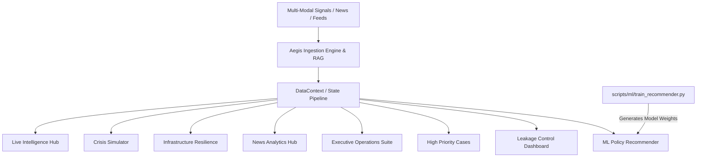

# 🌪️ CalamityAI — Catastrophe Risk Intelligence & Crisis Command Center

[](https://react.dev/)
[](https://www.typescriptlang.org/)
[](https://vitejs.dev/)
[](https://tailwindcss.com/)
[](https://scikit-learn.org/)

**CalamityAI** is an enterprise-grade catastrophe risk intelligence, crisis simulation, operations orchestration, and claims leakage prevention platform designed for insurers, reinsurers, catastrophic risk officers, and emergency response teams.

By unifying early predictive warning signals, multi-modal ingestion, geospatial exposure mapping, what-if crisis simulation, automated goodwill outreach, and claims fraud detection, CalamityAI closes the critical latency window between catastrophe onset and claims resolution.

---

## 📌 Executive Summary & Description

When major natural disasters strike—such as Category 5 hurricanes in Miami, catastrophic monsoons in Mumbai, tidal storm surges in Jakarta, or severe bushfires in Sydney—insurers and emergency coordinators face three existential challenges:

1. **Information Asymmetry & Lag**: Early warning signals from weather sensors, satellite imagery, and news feeds are fragmented and delayed.
2. **Infrastructure Overload**: Influx of customer claims and queries overwhelms adjusters, call centers, and IT infrastructure.
3. **Severe Claims Leakage**: Post-disaster chaos leads to inflated claims, fraudulent filings outside the disaster perimeter, duplicate submissions, and speculative claims filed before landfall.

**CalamityAI solves these bottlenecks** through an integrated command center featuring:
- **Temporal Lifecycle Intelligence**: Continuous monitoring partitioned across **Pre-Calamity (Forecast)**, **Active Calamity (Ongoing Impact)**, and **Post-Calamity (Recovery & Audit)** phases.
- **Physics-Informed Crisis Simulation**: Dynamic what-if scenarios modeling epicenter radius, magnitude, policyholder distribution, and field adjuster deployment.
- **Infrastructure Stress Guardrails**: Real-time compute pressure tracking with automated orchestration (AI chat routing, cloud auto-scaling, adjuster pool activation).
- **Proactive Goodwill Operations**: Automated safety checks and outreach dispatched to policyholders in the highest-risk impact zones.
- **Multi-Vector Leakage Auditing**: Automated detection of geospatial perimeter violations, claim inflation, timing mismatches, and syndicate fraud signatures.
- **Embedded ML Policy Recommendation**: Scikit-Learn multinomial model matching customized coverage to geographic and demographic risk profiles.

---

## 🏛️ Platform Architecture & Feature Modules



### 1. 🛰️ Live Intelligence Hub (`/`)
- **Interactive Catastrophe Map**: Visualizes hurricane tracks, flood inundation zones, wildfire perimeters, and policyholder concentrations using Leaflet (Dark, Standard, and Satellite base layers).
- **Temporal Event Tracking**: Filters incidents across *Pre-Calamity*, *Active Calamity*, and *Post-Calamity* timelines.
- **Neural Link Risk Index**: Real-time radar visualization of operational readiness, vulnerability, damage density, and claims velocity.
- **Aegis Multi-Modal Ingestion**: Upload and synthesize multimodal intelligence (satellite imagery, damage photos, sensor telemetries, and social media distress signals).

### 2. 🧪 Crisis Simulator (`/simulator`)
- **What-If Scenario Modeling**: Dynamic slider-controlled adjustments for disaster magnitude, storm movement, and coverage radiuses.
- **Real-Time Exposure Calculation**: Computes exposed capital, affected policyholder count, and estimated property loss instantaneously based on magnitude coefficients.
- **Field Operations Overlay**: Visualizes deployed emergency adjusters, response teams, and safe land corridors.

### 3. ⚡ Infrastructure Resilience (`/infrastructure`)
- **System Pressure Telemetry**: Monitored system pressure index calculated from incoming claims surge, server CPU/memory load, API latency, database connection pools, and queue depths.
- **Predictive Surge Forecasting**: 24-hour forward-looking load curves predicting server saturation before landfall.
- **Dynamic Orchestration Actions**: Automated triggers to route Tier-1 claims to AI chat, provision elastic compute nodes, or activate reserve adjuster pools.

### 4. 📰 News Analytics Hub (`/news`)
- **RAG-Powered Catastrophe Intel**: Query repository intelligence and global news streams using natural language chat.
- **Intelligent Hub Routing**: Automated geographic entity resolution mapping global events to managed operational hubs (Miami, Mumbai, Jakarta, Sydney).
- **Sentiment & Severity Scoring**: Automated urgency rating and category classification (news alerts, early warnings, general advisories).

### 5. 📊 Executive Operations Suite (`/analytics`)
- **Executive KPI Aggregation**: Comprehensive portfolio exposure, reserve liquidity requirements, and claim volume distribution.
- **Manpower & Adjuster Projections**: Workforce capacity planning modeling field adjusters, remote desks, and AI processing ratios.
- **Policy Distribution**: Interactive breakdowns across Homeowners, Commercial Property, Flood Premium, Renters, Auto, and Life coverages.

### 6. 🚨 High Priority Cases (`/priority`)
- **Epicenter Proximity Triage**: Automatically prioritizes policyholders closest to the disaster epicenter.
- **Goodwill & Safety Automation**: One-click automated safety verification emails with built-in state tracking.
- **Emergency Dispatch**: Escalation pathways for rapid response teams, direct dial verification, and AI-assisted claims pre-approvals.

### 7. 🛡️ Leakage Control Dashboard (`/leakages`)
- **Multi-Vector Fraud Detection**:
  - *Geospatial Anomaly*: Claims filed from addresses outside verified meteorological impact radiuses.
  - *Temporal Inconsistency*: Claims submitted prior to physical landfall or during speculative windows.
  - *AI Audit Variance*: Over-claiming and inflated repair estimates against localized historical baselines.
  - *Systemic Fraud*: Duplicate filing signatures, coordinated multi-policy exploitation, and syndicate patterns.
- **Audit & Resolution Flow**: In-app claim verification, fraud flagging, and resolution actions that immediately update capital risk metrics.

### 8. 🧠 Policy Recommender (`/recommender`)
- **Machine Learning Recommendations**: Embedded multinomial logistic model trained via Python (`train_recommender.py`) that scores coverage fit based on hazard indicators, asset value, property type, and city hazard priors.
- **Instant Client Quotation**: Interactive profile builder allowing risk advisors to configure client financials and evaluate real-time hazard suitability.

---

## 🛠️ Technology Stack

| Layer | Technology |
|---|---|
| **Frontend Framework** | React 18.3, TypeScript 5.5 (Strict Mode) |
| **Build & Bundler** | Vite 5.4, ESBuild |
| **Routing & Transitions** | React Router v7 / v6 DOM, Framer Motion |
| **Styling & Design** | Tailwind CSS 3.4, PostCSS, Glassmorphism, Custom Dark Theme |
| **Mapping & GIS** | Leaflet 1.9, React-Leaflet 4.2, CartoDB & Esri Satellite Layers |
| **Data Visualization** | Recharts 3.8 (Area, Bar, Pie, Radar charts), Lucide React |
| **Machine Learning** | Python 3, Scikit-Learn 1.4, NumPy 1.26 |
| **Mock Data & Scripts** | Node.js CommonJS pipelines (`generate_data.cjs`, etc.) |

---

## 🚀 Getting Started

### Prerequisites
- **Node.js**: `v18.x` or later (`v20+` recommended)
- **npm**: `v9.x` or later
- **Python**: `3.9+` (optional, only needed for re-training the ML recommender model)

### 1. Installation

Clone the repository and install dependencies:

```bash
git clone https://github.com/ChakShubh/CalamityAI.git
cd CalamityAI
npm install
```

### 2. Running in Development Mode

Start the local development server:

```bash
npm run dev
```

Open [http://localhost:5173](http://localhost:5173) in your browser.

### 3. Demo Credentials

The platform features an enterprise authentication gateway. Use the following default credentials to sign in:

| Field | Value |
|---|---|
| **Username** | `admin` |
| **Password** | `admin` |

*(Session state is securely maintained in local storage).*

---

## 🧪 Quality Assurance & Scripts

| Command | Description |
|---|---|
| `npm run dev` | Starts the Vite local development server with hot-reload |
| `npm run typecheck` | Executes strict TypeScript type validation (`tsc --noEmit`) |
| `npm run lint` | Runs ESLint 9 across all source files |
| `npm run build` | Compiles and bundles production-ready assets into `dist/` |
| `npm run preview` | Previews the production build locally |
| `npm run train:recommender` | Trains the Python ML recommender model and outputs `recommender_model.json` |

---

## 🤖 Machine Learning Pipeline (Policy Recommender)

The policy recommendation engine uses a multinomial logistic regression classifier trained on historical insurance claims, hazard intensity profiles, and policyholder distributions.

To retrain or update the model:

```bash
# 1. Install Python dependencies
pip install -r scripts/ml/requirements.txt

# 2. Train and export weights to src/data/recommender_model.json
npm run train:recommender
```

The exported weights are stored in `src/data/recommender_model.json` and loaded for client-side inference without requiring a dedicated Python server runtime.

---

## 📂 Project Structure

```text
CalamityAI/
├── generate_data.cjs          # Generator for synthetic policyholders & landmarks
├── generate_llm.cjs           # Generator for multi-modal news & intelligence feeds
├── generate_news.cjs          # Generator for supplementary regional news feeds
├── index.html                 # HTML application root
├── package.json               # NPM dependencies, scripts, and metadata
├── tsconfig.app.json          # TypeScript compiler configuration (strict mode)
├── vite.config.ts             # Vite bundler configuration
├── scripts/
│   └── ml/
│       ├── requirements.txt   # Python dependencies (scikit-learn, numpy)
│       └── train_recommender.py # ML training script for policy recommendation
└── src/
    ├── App.tsx                # Master routing, authentication gate, and layouts
    ├── main.tsx               # React application entrypoint
    ├── index.css              # Global styles, glassmorphism tokens, and scrollbars
    ├── components/
    │   ├── features/          # Feature widgets (MultiModalIngestionModal, ResourceRerouting)
    │   ├── layout/            # Layout components (Sidebar, TopNav, TickerTape, ToastContainer)
    │   └── pages/             # Route views:
    │       ├── AnalyticsDashboard.tsx      # Executive Operations Suite
    │       ├── CrisisSimulator.tsx         # What-if Catastrophe Simulation
    │       ├── HighPriorityDashboard.tsx   # Epicenter Triage & Goodwill Outreach
    │       ├── InfrastructureResilience.tsx# Infrastructure Load & Cloud Scaling
    │       ├── LeakageDashboard.tsx        # Multi-Vector Fraud & Leakage Audit
    │       ├── LiveIntelligence.tsx        # Real-time Threat Map & Radar Console
    │       ├── LoginPage.tsx               # Authentication Screen
    │       ├── NewsAnalytics.tsx           # RAG News Interrogation Hub
    │       └── PolicyRecommender.tsx       # ML-driven Coverage Advisor
    ├── constants/             # Exposure models and demo geography presets
    ├── context/
    │   └── DataContext.tsx    # Global React state (disasters, telemetry, toasts, feeds)
    ├── data/                  # Pre-compiled JSON datasets (disasters, claims, policyholders)
    └── utils/                 # Utility libraries (geocoding, eventPhase, RAG, workforceModel)
```

---

## 🌍 Supported Operational Hubs

CalamityAI is pre-configured with operational telemetry for key high-risk metropolitan areas:
- 🇺🇸 **Miami, USA**: Category 4/5 Hurricanes, storm surges, coastal flooding.
- 🇮🇳 **Mumbai, India**: Severe monsoon flooding, infrastructure disruption, cyclones.
- 🇮🇩 **Jakarta, Indonesia**: Tidal surges, ground subsidence, flash flooding.
- 🇦🇺 **Sydney, Australia**: Wildfires, bushfire fronts, extreme heat conditions.